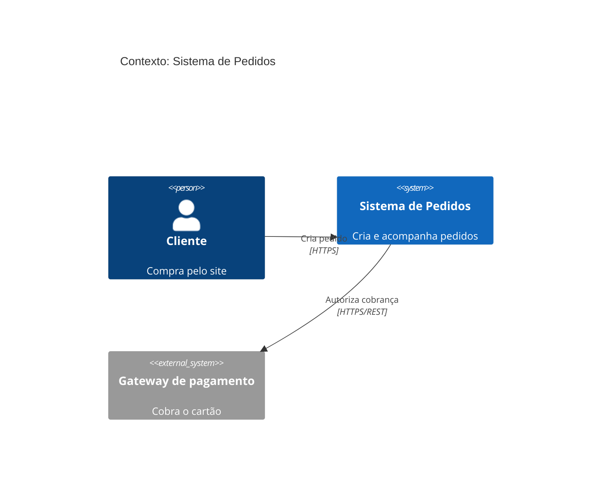
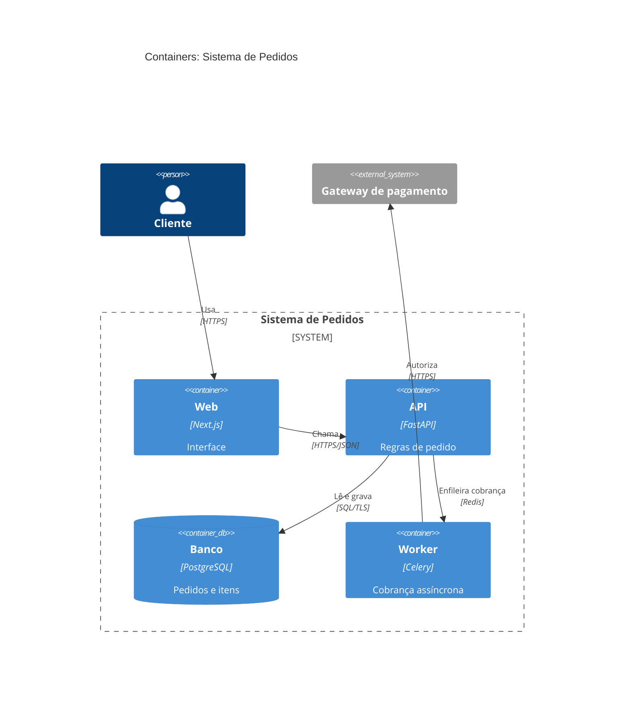

# C4 em Mermaid

Regras: até 20 elementos por view, toda seta com rótulo (o que trafega e por qual protocolo),
IDs estáveis reaproveitados em ADRs e no threat model, declaração na ordem de leitura
(de quem usa para o que é usado).

## Context



## Container



## Render

```bash
npx -y @mermaid-js/mermaid-cli -i docs/architecture/c4.mmd -o /tmp/c4.svg
```

Se o comando falhar, o diagrama tem erro de sintaxe e não está pronto.
